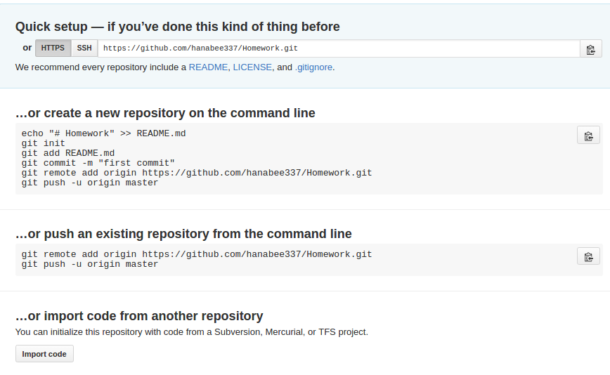

#Day7
#**git 명령어(command) 정리하기**
---
하기 김준모님께서 git 정리하신 내용 참조하세요. 정리가 훨씬 더 자~알 되어있습니다.   
https://github.com/fastcampus-school/computer_basic_assignment_171q_web/tree/master/170117/joonmo.kim  

1.**```git init```** : git 초기화. working directory에 .git 폴더가 생성됨. local repo 생성.  
>	git init을 한 번 하면 .gitignore를 작성해 주어야 편하다.  
	  gitignore.io에서 설정 가능.  

2.**```git status```** : working directory상태 확인. staging area에 올라간 파일들.  
3. **```git add 파일명```** : working directory에서 staging area로 파일이 이동.  
4. **```git add -all```** or **```git add -A```** : staging area에 모든 것을 올리겠다.  
5. **```git commit```** : staging area에서 local repo로 이동.  
>		commit 단위는 기능 단위를 기준으로 한다.  

6. **```git commit -s```**: commit message 작성 후, local repo로 파일이 이동.  
	ubuntu는 commit meesage창에서 ctrl+o로 저장하고, ctrl+x로 끝내기 하면, 자동으로 commit됨.  
7. **```git commit -m {커밋할 메시지 내용}```** : 커밋 메세지를 바로 입력.  
8. **```git commit -a```** : staging area로 모든 파일을 올리겠다는 의미.  
9. **```git commit -a -m {커밋 메세지 내용}```** : staging area로 모든 파일을 올리고, 커밋 메세지까지 입력시키겠다는 의미.  
10. **```git log```** : commit 이력을 보여줌.  
11. **```git log --oneline```**: git log들을 한 줄씩만(commit 번호만 출력) 보여줌.  
12. **```git commit --amend```** : commit message만 수정을 원할 경우.  
13. **```git diff {파일명}```** : 파일 변경된 내용을 보여줌(git add 하기 전 상태에서).   
14. **```git log -p```** : 변경된 내용을 보여줌.  
15. **```git reset --hard {commit번호}```** : 특정 commit 번호로 reset: local repo엔 특정 commit상태로 reset됨.  
16. **```git reset --hard HEAD^1```**: 마지막 commit 1개를 reset시킴.  
17. **```git reset --hard HEAD~~```**: HEAD는 현재 브랜치를 가리키는 포인터이며, 마지막 커밋의 스냅샷이다.  
이 명령어는 git init하고 처음 commit했을 때의 commit버전으로 reset시킨다는 의미.  
18. **```git reset --hard ORIG_HEAD```** : 마지막으로 reset 시켰던 commit 버전으로 원복시킴.reset 실행 전의 상태로 되돌림.  
19. **```git reset HEAD {파일명}```** : staging area에 있는 파일을 working direct으로 마지막 commit상태로 reset시킴.  
20.  **```git show {commit번호}```** : 해당 commit 내용을 show.  
21. **```git checkout {브랜치명}```** : 해당 브랜치로 이동.  
22. **```git checkout -b {브랜치명}```** : 해당 브랜치를 하나 만들고, 그 브랜치로 이동.  
23. **```git branch -v```**: 브랜치들의 최종 commit 상태를 보여줌.  
24. **```git branch -D {브랜치명}```** :  해당 브랜치명 삭제.  
25. **```git branch {생성할 branch 이름}```** : 현재 위치에서 새로운 브랜치 생성.  
26. **```git merge {fix 브랜치의 commit 번호}```** : 현재 브랜치는 html인데, fix 브랜치의 특정 commit을 html 브랜치로 merge시켜라.  
**합칠 브랜치에서 합쳐질 브랜치를 merge한다.**  
27. **```git pull origin {브랜치 이름}```** : 해당 브랜치를 pull 하는 명령어.  
28. **```git revert {commit 번호}```**: 해당 커밋만 revert.  
29. **```git diff --staged -M```** : 파일이 이동한 것을 감지하는 기능 
30. **```git blame {파일명}```** : 특정 파일의 수정 이력 파악

#git 실습
### remote repository 만들고 local push하기
1. git remote add origin https://github.com/hanabee337/second_git.git
2. git push -u origin master  

github에서 new repo를 만들고 나면  
  

local에선 하기와 같은 command line으로 new repo 설정한다.  
  

### gitignore
.gitignore 쓸 필요가 없거나 git에서 관리될 필요 없는 파일들을 여기에 명시해준다. 
> https://www.gitignore.io/ 에서 생성하면 편하다.(python,win,macos,pycharm등을 입력)
> **git init 하자마자 해줘야 한다. (repository 생성과 동시에 해야 트래킹하지 않는다.)**
	각자 다른 setting환경에서 개발하기 때문에 발생하는 conflict를 방지하기 위한 목적.  
	처음 레포지토리 만드는 사람이 생성하고 이니셜 커밋을 해야함.  
	이 .gitignore를 collaborator들이 모두 같이 사용하기 때문.   

## 실습 순서
1. git init(git 초기화. working directory에 .git 폴더가 생성됨)  
2. .gitignore 생성 + README.md생성해보기  
3. initial commit  
4. branch 분기  
	4.1 master 브랜치에서 html 문서용, css용 브랜치 분리해보기.  
	4.2 분기한 html branch에서 html의 master + feature + fix 3가지 branch로 만들어서 마지막에 html의 master branch로 merge하는 실습해보기.  
	4.3 같은 방식으로 html을 master 브랜치에 merge하고 css 브랜치도 master 브랜치에 merge하기  
