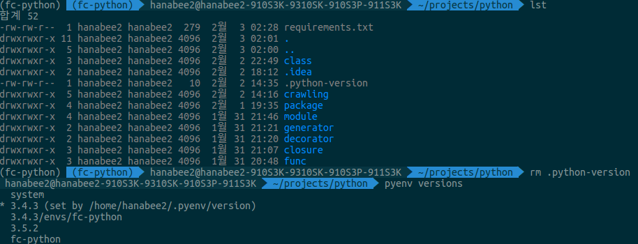
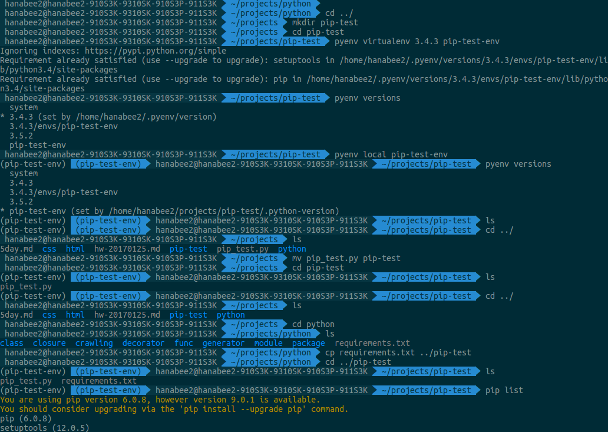
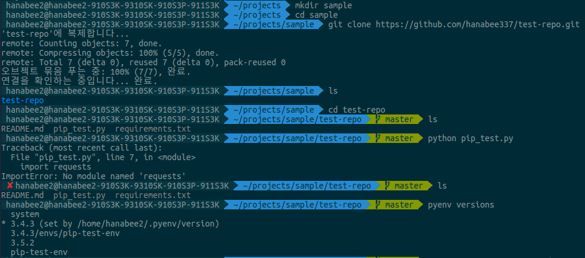
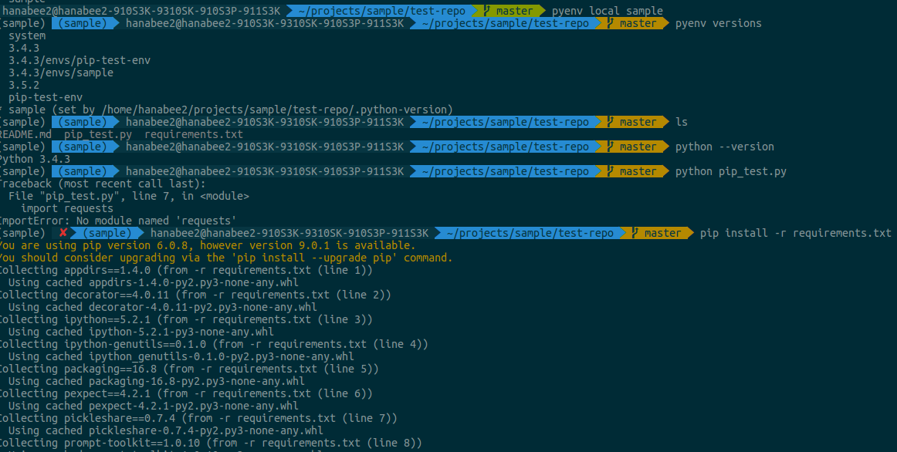
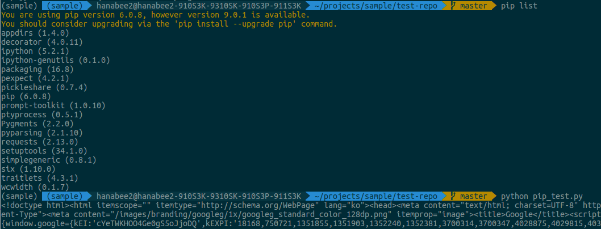

# pyenv 환경 실습(Ubuntu 환경)
## 내가 작업하고 있는 환경을 github에 올린 것을 누군가가 받아서 사용하려고 할 때를 가정하고 실습한 내용
- 기본적인 실습 순서는 다음과 같다.
```
1. pip_test 폴더에서 가상환경을 생성
2. 생성한 가상환경을 github에 올림
3. github에 올라간 가상환경을 sample 폴더로 받아오기.
```

- 기본적인 내용은 하기 파일 참조.
```html
<https://github.com/hanabee337/study/blob/master/13_pyenv_virtualenv_iPython_install_guide.md>
```
### 1. 기존 생성된 가상환경 삭제하기
- python이 있는 폴더에서 ```pip freeze```함.
- 그렇게 하면 현재 버전들을 list-up해줌.
```shell
$pip freeze : 내가 가상환경에 설치한 패키지 정보들을 알려줌
```


- 내가 ```가상환경에 설치한 패키지 정보들을 requirements.txt파일에 저장```
- txt 파일의 목적은 repo 관리할 때, txt 파일도 같이 올려줘야 git clone한 사람이 동일한 환경으로 가상환경 패키지들을 설치할 수 있기 때문.
- 따라서 , requirements.txt도 버전 관리를 해야함.
```shell
$ pip freeze > requirement.txt
txt 파일에 저장
```


- projects/python 폴더에 있는 ```.python-version``` 삭제



- projects/python 폴더에 설치한 virtualenv 인 ```fc-python uninstall```
- 물리(?)적인 환경```3.4.3/envs/fc-python```과 가상환경```fc-python```이 모두 없어진 것을 확인 할 수 있다. 


- ```pip list```로 설치된 패키지 확인
- 아까는 설치되어있던 ```requests 패키지가 없음```을 알 수 있다.(위의 그림 참조)


### 2. 새로운 가상환경 만들기(pip_test 폴더용)
- projects에서 pip-test 폴더 새로 생성한 후, ```pip-test폴더로 이동```
- pip-test 폴더용 가상환경 생성
```vim
pyenv virtualenv <파이썬 버전> <env_name>
$ pyenv virtualenv 3.4.3 pip-test-env
```
- ```파이썬 3.4.3 버전으로 pip-test-env라는 이름의 가상환경을 생성하겠다는 의미```
- pip-test-env(가상)와 3.4.3/envs/pip-test-env(물리?) 두 개가 생성된 것을 확인할 수 있다.


- ```pip-test 폴더로 이동```한 후, ```생성된 가상환경을 local화하기```
- 즉, ```생성한 가상환경(pip-test-env)```을 ```pip-test 폴더에서만``` 사용하겠다는 의미.
- local화 하자, pip-test-env로 변경된 것을 알 수 있다.
```
pyenv local <env_name>
$ pyenv local pip-test-env
```


- pip list : 현재 설치된 패키지들을 보여줌.
- 현재 설치된 패키지가 pip하고 setuptools밖에 없다는 것을 볼 수 있다.
- 그렇담, pip-test.py를 실행시키면 여기선 돌아가지 않을 것이다. requests 패키지가 없으니까.


 
### 3. 생성한 가상환경 github에 올리기
- 생성된 가상환경들을 github에 올리기
- github에서 새 repo 만듬
- $ git init
- .gitignore도 만들어줌 (.gitignore를 먼저 만들어주지 못하면 나중에 커밋된 것들은 추가되지 않으므로 저장소 다시 지우고 만들어야 할 수 도 있다 이럴땐 .git폴더 지우고 다시 커밋하면 됨.. 처음부터..), .idea/도 생성이 되었음. 왜지?
- add하고 push 함.
- README.md, pip-test.py, requirements.txt 파일을 github에 올린다.
- README.md은 파이썬 버전을 적어준다.
- pip-test.py은 사용자가 실행할 파이썬 모듈
- requirements.txt 파일은 언급하였듯이 패키지 환경 정보 저장된 파일

### 4. github에 올라간 가상환경 내려받기(sample 폴더용)
- project 폴더에서 sample 폴더 생성한다.
- sample 폴더에서 git clone을 해오기.



- clone 받은 폴더에 가서 가상환경 다시 만들기


-  생성한 가상환경으로 local화


 
- 근데, 프로젝트에 사용된 패키지는 설치가 안되어있다.(예를 들면, requests)


- 그래서, python pip-test.py 실행시, requests가 없어서 import 에러가 나야함


- 그래서, pip install -r requirements.txt를 하면 import 시 발생했던 에러가 해결이 된다.





- Q) 파이썬 버전은 git clone한 사람이 어떻게 알까?
A) README 파일에다가 inform해주기.

### 5. virtualenv가 지워졌으므로 python 폴더용 가상환경 설정을 해주어야 함
1. pyenv virtualenv <version> <env_name> 으로 가상환경생성

	- $ pyenv virtualenv 3.4.3 fc-python
	- python 3.4.3 버전으로 fc-python이라고 하는 가상환경을 생성하겠다는 의미
	
2. 해당 폴더(projects/python)에서 pyenv local fc-python으로 가상환경 사용 설정
	- 예) projects/python 에서
	- $ pyenv local fc-python 
	- 1번에서 만든 가상환경을 작업할 해당 폴더에서 local화 하겠다는 의미.
	- local화란 1번에서 생성한 가상환경을 해당 폴더에만 적용시키겠다는 의미.
	
3. pyenv versions로 설정 적용되었는지 확인, pip list로 새 가상환경 상태인지 확인
	- $ pyenv versions
	- $ pip list
	
4. $ pip install -r requirements.txt.로 패키지 설치
	- 생성한 가상환경에 맞는 패키지들을 설치하겠다는 의미
	
5. pyenv uninstall <가상 env_name>
	- 예) $ pyenv uninstall closed_projects
	- 그렇게 하면, 가상과 물리 모두 삭제가 됨
	- 3.4.3/env/closed_project - 물리(?)
	- closed_projects - 가상
	- 두 개가 모두 없어짐.
	- pyenv versions로 확인 가능
	
6. ipython도 지워졌으므로, 설치를 다시 해줘야 한다.
	- $ pip install ipython

7.  BeautifulSoup4 설치 명령
	- $ pip install beautifulsoup4

8. requests 패키지 설치 명령 
	- $ pip install requests

9. PyCharm에서 환경 설정을 해줘야 하는데, Ubuntu에서는 
```
`/home/<자기유저명>/.pyenv/versions/3.4.3/env/<가상환경이름>/bin/python`
로 파이참에 프로젝트 인터프리터 설정해준다. 
```
