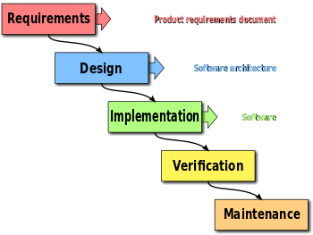
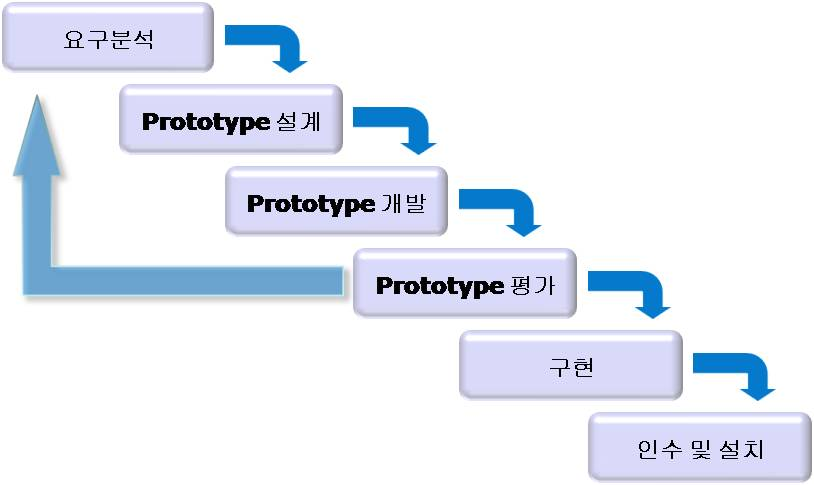
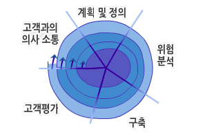
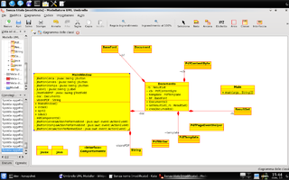

#소프트웨어 공학
###공학이란
수학과 자연과학을 기초로해서 유용한 사물이나 환경을 구축하는 것을 목적으로 하는 학문.  
그렇담, **소프트웨어 공학**이란 ?  
기존의 공학의 개념과 좀 다른데, 어떻게 하면 좀 체계적으로 소프트웨어를 개발할 수 있는지에 대한 체계적으로 정리한 학문.  
소프트웨어의 개발,운용, 유지보수 및 폐기에 대한 체계적인 접근 방법.  

# 소프트웨어 개발 생명주기 모델
소프트웨어를 어떻게 개발할 것인가에 대한 전체적인 흐름.  
1. 폭포수
####폭포수 모델

요구사항 -> 디자인(소프트웨어 구조 설계) -> 구현(소프트웨어) -> 검증(요구사항, 설계대로 잘 동작하는 지에 대한 검증) -> 유지보수
단점 : 앞 단계가 끝나야지만 , 다음 단계로 넘어갈 수 있다(시간이 오래 걸림). 앞 단계에서 잘못된 점을 다음단계에 가야 알 수 있다.  
2. 프로토타이핑
폭포수의 단점을 보완하기 위한 모델.  

 단점 : 평가 단계에서 communication하는데 소요시간이 많이 걸림.  
  
3. 나선형

폭포수와 프로토타이핑의 단점들을 보완하는 모델을 제시.  

소프트웨어 공학이 대두된지는 얼마되지 않아, 실제 field에서는 폭포수 모델이 가장 흔함.  

#소프트웨어 개발 방법론이란
소프트웨어를 생산하는데 필요한 반복적인 과정들을 정리한 것.   
종류 : 객체지향, 구조적 프로그래밍, 고속 개발 방법론, 익스트림 프로그래밍(Agile)..   

1. 애자일 개발 프로세스
간단히 말하자면, 획일화된 방법론이 아님.  
다른 고전적인 방법론관 구별되는 가장 큰 차이점은
less doc oriented, 즉 문서를 통한 개발 방법이 아니라, code-oriented 실질적인 코딩을 통한 방법론.
앞을 예측하여 개발을 하지 않고, 
일정한 주기를 가지고 끊임없이 프로트타입을 만들어내며, 그때 그꺠 필요한 요구를 더하고 수정하여 하나의 커다란 소프트웨어를 개발해 나가는 adaptive style.   
특정한 밥법론을 가리키는 말이 아니고, agile(좋은 것을 빠르고 낭비없게 만드는 것) 개발을 가능하게 해 주는 다앙햔 방법론 전체를 일컫는 말.  
관리자가 선호하는 모델..개발자들의 업무량을 scrum을 통해 daily 확인할 수 있어, 반대론자들도 있음.강사도 동의..  

2. UML
통합 모델링 언어. 표준화된 범용 모델링 언어  
객체지향 소프트웨어 집약 시스템을 개발할 때 산출물을 명세화, 시각화, 문서화할 때 사용.  

s/w 개발 방법론 + 모델 + 클래스 다이어그램  

3. TDD
테스트 주도 개발.  
Test Drive Development  
매우 짧은 개발 사이클을 반복하는 소프트웨어 개발 프로세스.  
		
	1. 결함을 점검하는 자동화된 테스트 케이스 작성
	2. 케이스를 통과하기 위한 최소한의 양의 코드를 생성
	3. 새 코드를 표준에 맞도록 리팩토링

4. PDD
Plan Driven Development  
계획 기반 개발  
계획을 세우고 그 계획을 실천하는데에 많은 시간과 노력을 할애하는 개발 방법.  

5. 형상관리
sw개발 및 유지보수 과정에서 발생하는 소스코드, 문서, 인터페이스 등 각종 결과물에 대해 형상(원본을 뜬다)을 만들고, 이들 형상에 대한 변경을 체계적으로 관리, 제어하기 위한 활동. 이 활동의 일종이 버전관리이다.예) git  

6. 버전관리
형상관리의 일종  
일반적인 소프트웨어 소스 코드만의 형상을 관리하는 것,  

#프로그래밍 언어
언어가 다양한 이유는 ?
프로그래밍 언어가 다양한 이유?..C 언어로 개발하면 될 것을...
여러가지 목적에 따라 다른 언어를 쓴다.  
강사님 의견 : 컴퓨터의 동작 기본원리, 구조, 메모리 등을 파악하는 데에는 C만큼 쉽고 좋은 언어가 없다.   

###종류
고급언어에서 저급언어로 변환되는 과정(0과 1로 바뀌는 시점: **컴파일 시점**)에 따른 분류  
컴퓨터가 이해할 수 있는 언어(0과 1)로 변환 : 컴파일
컴파일러 : 컴파일을 해주는 시스템 s/w  

1. 컴파일 언어
**C**, C++, ...
컴퓨터가 알아들을 수 있는 언어로 전부 컴파일을 하여 사용자에게 배포하는 언어.  
배포된 언어는 이미 기계어라 컴퓨터가 바로 알아들을 수 있으므로 실행속도가 빠름. 
기계어라 원본 유출의 위험이 적다.   
 코드가 많으면 많을 수로 빌드 과정이 오래 걸림.  
 코드 한 줄을 수정해도 전체 코드로 컴파일을 해야 하므로, 생산성이 떨어짐.  
 사용 예) 컴퓨터 게임 프로그램. LOL, Diablo...-> 컴푸터가 바로 알아먹을 수 있는 기계어라 실행속도가 빠르니까..
 위기 대처가 느리다. 수정하고 컴파일하고 확인해보구 다시 수정하고..빌드 시간이 길어서..
 실행속도는 빠르다. 배포,수정이 어렵다.생산성이 떨어진다.
 환경에 따라 빌드를 다르게 해주어야 함.  
 (C로 프로그래밍 했더라도, Win용으로 빌드, Mac용으로 빌드를 따로따로 해주어야 함. 각각의 환경에서 알아들을 수 있기 하기 위해) 
 
2. 인터프리터 언어
Javascript, **Python**, Ruby...
소스코드 자체를 실행할 수 있음.  
컴파일 언어와 달리 , 컴파을을 하여 실행 할 수 있는 언어로 배포하는 것이 아니라,
코드 한 줄 한 줄을 컴파일하고 배포 해주는 언어(이런 과정을 인터프리터가 해줌) -> 실행 속도가 느림.
개발환경에서는 빌드 시간이 짧음.. 코드 한 줄 변경을 해도 바로 결과를 확인해 볼 수 있음. -> 생산성이 좋음,
위기 대처에 빠르다...버그 수정.  
한 줄 수정하고 바로 결과 확인가능하므로..   -> 위기 대처 능력, 생산성이 좋다.
사용 예)
파이선은 인터프리터 언어이므로 실행속도가 느리다.  
이러한 단점을 극복하기 위해 중간중간에 미리 컴파일을 함으로써(just-in compile: JIT 컴파일), 인터프리터의 한계를 극복하고자 함.

3. 바이트 코드 언어
**Java**, C#...
탄생 배경..
Java -> 중간 언어 -> 기계어(0과 1의 조합), 컴파일된 언어
java를 중간 언어로 변환시켜주는 해석기가 있고, 중간 언어를 갖고 다시 해석기를 통해 기계어를 산출.
그렇담, 중간 언어를 기계어로 해석해 주는 것이 JVM(가상 머신).
장점 : 시스템마다 따로따로 해석을 할 필요가 없다.  
       중간 언어를 해석할 수 있는 시스템만 있다면 시스템에 맞게 실행을 할 수 있다는 점.
단점: 빌드, 배포를 하려면 시간이 많이 걸림. 해석 단계가 2단계. 최적화가 어려움. 실행속도가 느림.
Java는 시스템마다 따로따로 해석을 할 필요가 없다는 장점과 인터프리터의 모든 단점을 가지고 있는 언어.
한바이트마다 해석해서 바이트 코드라 함.
다른 플랫폼상에서도 이식을 용이하게 하기 위해 만들어진 코드가 Java.
즉, 서로 다른 플랫폼에서도 java라는 바이트 코드를 넣으면 바로 실행 시킬 수가 있다는 의미.
안드로이드에서도 java를 사용하라고 하였음.

지금은 다양한 언어가 존재하므로, java를 굳이 고집할 필요가 없는데..
왜 우리나라만 java에 집착하나?..정부..

때에 따라, 프로그래밍 언어의 적합도(?)가 다름.

# 프로그래밍 패러다임
패러다임이란 ? 어떤 사물을 바라보는 관점.
프로그래밍의 관점이란 의미.

1. __객체지향 프로그래밍 패러다임__
>	프로그램을 상호작용하는 객체들의 집합으로 표현.
예) python, swift, c++, ruby, java..

2. __함수형 프로그래밍 패러다임__
>	프로그램을 상태값을 지니지 않는 함수값들의 연속으로 표현.
예) python, swift, c++, ruby, java...

Python : 다중 패러다임.
현재는 객체지향에서 문제점이 많이 노풀되어 함수형 프로그래밍 패러다임으로 바뀌는 추세.
이유는 대규모 병렬처리를 위해서..
 
#객체지향 프로그래밍 패러다임
컴퓨터 프로그램을 명령어의 목록으로 보는 시각에서 벗어나 **여러 개의 독립된 단위, 즉 객체들의 모임**으로 파악하여, ==객체간의 상호작용==으로 프로그램의 동작을 구현하고자 하는 것.
**왜 객체지향 프로그래밍 패러다임이 생겼을까?**
예전엔 프로그램을 복잡하게 짤 필요가 없었음. 근데, 이젠 기능들이 많아지며 복잡해졌다.
이로 인해, 기능들을 세분화함으로써 코드 작성을 용이하게 할 필요가 대두함. 
클래스의 객체화(실질적인 형태)
강사(야곰): 파이썬은 객체와 클래스의 상관관계를 잘 알아야 수월히 할 수 있다고 함.

1. 객체(Object)
- 의식과 행위를 가지는 형체.

2. 클래스(Class)
- 공통점/특성을 가진 객체들의 모임. 이러한 객체들의 모임을 클래스라는 코드로 푠현.
- 객체가 가질 수 있는 속성과 행위를 정의하는 틀(템플릿, 설계도)
- 클래스를 본따서 여러 개의 객체들을 만들 수 있다.
- 인스턴스 
- ==클래스의 인스턴스를 객체==라고 부른다.
 
3. 객체의 생성

4. 클래스, 객체, 인스턴스, 메소드에 대하여
- 클래스
- 객체
- 인스턴스
- 메소드 

# 프로그래밍 용어
이것을 배우는 이유
-> 원활한 communication을 위해서이다.

###software developer
개발자란 무언가를 만드는 사람(?)
개발자의 종류) 프로그래머, 기획자, 디자이너 ....

### server/client
데이터 제공하는 쪽이 server, 받는 쪽이 client
server용 컴퓨터가 존해하는 것은 아님.

### front-end/back-end
front-end : 사용자에게 보여주는 프로그램 담당자. 그러나, front-end를 여기에 한정해서 부르진 않는다.
front/back -end는 관점에 따라 달라짐.
back-end : 사용자에게 보여지지 않는 프로그램 담당자.
강사님의 의견 : 우리는 웹서버 개발자가 더 적합한 표현.

### thread
>	실행되는 프로세스 내에서 여러 개의 작업이 실행되는 흐름의 단위.
mutil-thread vs multi-task: 

###mutil-thread
>	하나의 프로세스 안에서 여러 가지 일들이 병렬로 처리되는 것.
예) 하나의 프로그램에서 여러 가지 일이 진행되는 것.

###multi-task
>	하나의 시스템내에서 여러 개의 프로세스가 동시에 실행되는 것.
예) 음악을 들으면서 인터넷을 하는 것.

### library
>	특정 기능을 수행할 수 있는 클래스 또는 함수의 집합체.

### api
>	application programming interface
응용 s/w 프로그래밍 접합부
응용 s/w와 프레임워크 사이의 중간매체(방법)
s/w간의 통신을 위해 메세지를 전달하는 방식 등이 결정된 것.


### framework
>	구조적으로 고정된 부분을 재사용할 수 있도록 하고, 응용별 특정 기능을 추가적인 사용자 작성 코드에 의해 선택적으로 구현 가능하도록 하는 포괄적인 추상 구조, 그리고 이를 지원하는 소프트웨어 플랫폼.
framework vs lib

==lib==
```
원하는 기능을 구현해야 되는데, 이미 코드로 구현되어 있다. 그러면 굳이 우리는 코드를 작성할 필요가 없다.
가져다 쓰면 되니까.
```

==framework==
```
전반적인 환경을 구축해 놓은 것. 제반 환경을 미리 만들어 놓은 것.
예) python으로, dajngo framework을 구축해 놓았음. 웹 서버를 구축하기 위해선 환경 구축이 필요한데, 미리 이러한 환경들을 Django framework에서 구축해 놓았다는 의미.
```

비유해 보자면
```
프레임워크 - 국가(정부)
프레임워크의 하위 프레임워크 - 정부부처
api - 국가기관
lib - 직무 전문가
프로그래밍 언어 - 국가 통용 언어
레퍼런스 문서 - 국가 조직도 및 기능 설명서. 프레임워크 상에서 api를 잘 사용하려면 이 문서를 참조해라.
```
강사님 추천 사항: Dajngo 레퍼런스 문서 읽어보기.

Django framework + Python.
```
Django라는 나라 모양에 내가 원하는 일을 할 수 있는 기업을 세우는 것.
Django라는 나라에서는 파이선이라는 언어를 통해 의사소통 한다.
```
강사님 추천 사항: Django Framework의 구조를 분석해 보기.

### 디자인 패턴
프로그램 개발에서 자주 나타나는 과제를 해결하기 위한 방법 중 하나.
과거의 소프트웨어 개발 과정에서 발견된 설계의 노하우에 이름을 붙여, 이후에 재이용하기 좋은 형태로 묶어서 정리한 것.
예) 디자인, 영업, 기획, 마케팅 등으로 역할 분담. 객체들을 분업화.
이렇게 설계해보니 깔끔하고 좋더라..
- MVC(Model-View-Controller)
- MVVM(Model-View-ViewModel)

### 레퍼런스 문서
- API에 대해 서술해 놓은 문서.

###ide
- 통합 개발 환경
- Integrated Development Environment
예) pycharm, visual studio ...
예전에 이런 통합 개발 환경이 없었단 의미.

###sdk
- software development kit
- 소프트웨어 개발에 필요한 모든 도구의 모음.
- (IDE) + (Framework) + (Tools) ...여러 가지 조합으로 배포될 수 있다.
- 프레임워크사에서 sdk를 개발자들에세 배포함.

강사님(야곰)
```
이러한 기본적인 용어를 설명한 이유를 잘 파악할 것.
이해가 안되는 부분은 '컴퓨터 개론' 책 아무거나  읽어 보기.
강사님의 목적은 유의미한 삽질을 우리가 할 수 있도록 유도하는 것.
-> 개념이나 의미를 먼저 파악해보기. 왜라는 질문.
스스로 터득하고 연습해 보기.
```

##실제 Field에 대하여
웹 프로그래머 
1. 안보이는 로직 : back-end
2. 보이는 로직 : front-end
3. DB 개발자

1+2+3 : full-stack 개발자.
보통 하나 전문가 되는데, 3년 정도 소요.
근데, 1번 하는 동안 2, 3번은 안바뀔까?.
 full-stack 개발자를 목표로 한다는 것은 현실적을 불가.
 하나에만 집중하고 다른 것들은 보조로 공부하는 것은 의미있겠지만...
  
- 퍼블리셔: HTML,CSS
- front-end : Javascript
- back-end : python, asp, jsp, php, java, 
- db
- 디자이너
- 기획자 : 기획자는 PM,PL이 아님.

강사님왈
```
SI는 절대로 가지 말 것.
무슨무슨 솔루션이라고 하는 업체들...
책 추천 "나는 프로그래머다." 시리즈. 임백준 저. 팝캐스트
내가 진짜 가고 싶은 회사는 5번째 쯤에 면접을 봐라.
다른 회사들 면접을 먼저 보구, 
어떤 패턴으로 질문을 하는지 파악하여 면접을 준비해라.
가고 싶지 않은 회사들 순서대로 면접을 봐라.
```

과제:
1. HTML5의 탄생배경
2. 기존 HTML보다 이로운 점
3. 국내외의 HTML5 적용현황 비교